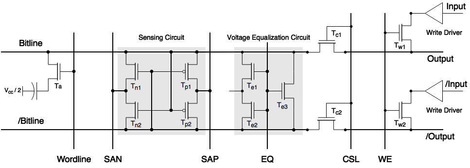
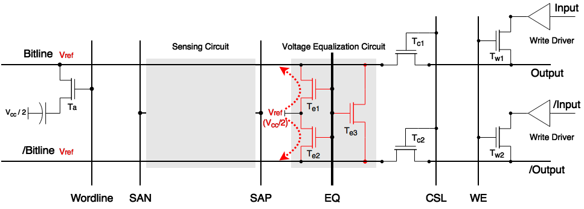
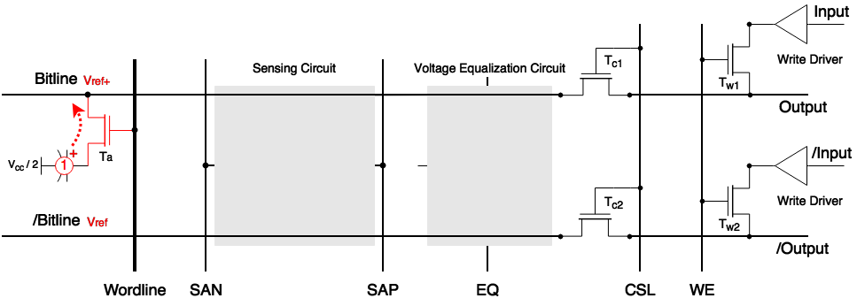
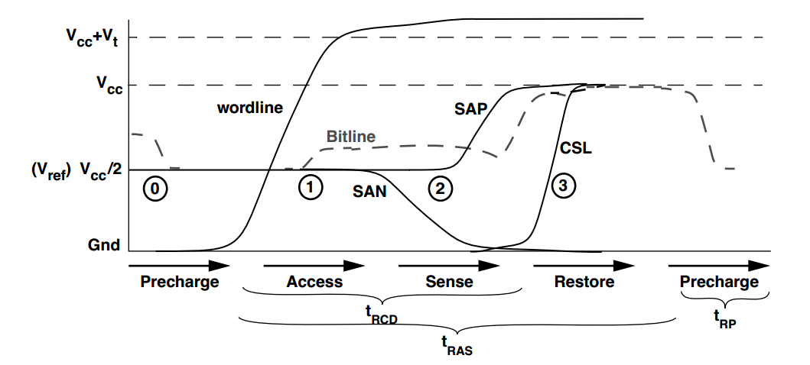

# DRAM-note

This is a note for some background knowledge of DRAM for personal use, summarized from [蜗窝科技's blogs](http://www.wowotech.net/basic_tech/307.html). Please refer to the link for more detail information, and do not use this note for commercial purpose.

## DRAM storage cell

### Simple model

Fig. 1 shows a simple example of 1T1C (1 transistor 1 capacitor) DRAM cell, the reference voltage is Vcc/2

 Fig. 1 DRAM cell example

The 0/1 information is stored on the capacitor. When the voltage of wordline is high, the information can be accessed/modified by the bitline.

### Problem of the simple model

1. Capacitor of the bitline is much larger than the storage capacitor
2. Voltage of the storage capacitor is changed after accessed
3. Leakage of charge leads to storage capacitor voltage's decay

To solve all these problems, the Differential Sense Amplifier is introduced.

### Differential Sense Amplifier

Sensing Circuit and Voltage Equalization Circuit are added to Fig. 1, shown in Fig. 2.

 Fig. 2 Differential Sense Amplifier

The read operation is performed in four steps, namely **Precharge**, **Access**, **Sense**, **Restore**. The write operation is performed in five steps, namely **Precharge**, **Access**, **Sense**, **Restore**, **Write Recovery**.

- Precharge
  
  Set EQ = 1, Te1, Te2, and Te3 are conducted, the voltage of Bitline and /Bitline is set to Vref=Vcc/2.
  

   Fig. 3 Precharge
  

  
- Access
  
  Set Wordline = 1 (here is an example, where information 1 is stored on the capacitor), then the voltage of Bitline is changed to Vref+.
  

   Fig. 4 Access
  

  
- Sense

  Because the voltage of Bitline is set to Vref+, Tn2 and Tp1 will be conducted. SAN and SAP are set to 0 and 1 respectively. Thus, Bitline and /Bitline will be charged to 1 and 0.
  

   Fig. 5 Sense
  

- Restore

  After the Sense step, the storage capacitor will be recharged by Bitline. Set CSL = 1, Tc1 and Tc2 are conducted, then the information can be read from the Output port.
  

   Fig. 6 Restore
  

- Write Recovery

  For write operation, after four steps above, set WE = 1, then the storage capacitor will be charged by the Input signal, through Tw1 and Tw2.

### Timing
Fig. 7 shows the timing of read operation.

 Fig. 7 Timing of read operation

## DRAM Memory Organization

Based on the organization of DRAM cell mentioned above, we can get an array of DRAM cells with some modifications, shown in Fig. 8. 

 Fig. 8 DRAM cells array

We have 8 worlindes, 1 CSL/WE, and we can access 2 bits at one time, so it's an 8✖1✖2 array. More generally, it can be a m✖n✖w array, where m is the number of Wordlines,  n is the number of CSL/WE, and w is the width of bits for once access. We call them Rows, Columns, and Data Width. A general example is shown in Fig. 9.

 Fig. 9 A Rows✖Columns✖Data Width array

For performance purpose, we call an array shown in Fig. 9 as a bank. Multiple banks are organized, and only one is accessed, shown in Fig. 10.

 Fig. 10 DRAM banks

## DRAM Device

We take SDR DRAM (Single Data Rate DRAM) as an example, the interface of an SDR DRAM is shown in Fig. 11.

 Fig. 11 SDR DRAM interface

The function of each port is shown in Table 1.

| Symbol | Type | Description |
| --- | --- | --- |
| CLK | Input | clock |
| CKE | Input | clock enable |
| CS# | Input | chip select |
| CAS# | Input | column address strobe/select |
| RAS# | Input | row address strobe/select |
| WE# | Input | write enable |
| DQMH/DQML | Input | masks for DQ |
| BA[1:0] | Input | bank address |
| A[12:0] | Input | address bus |
| DQ[15:0] | Input/Output | data bus |

Table 1 SDR DRAM interface function

